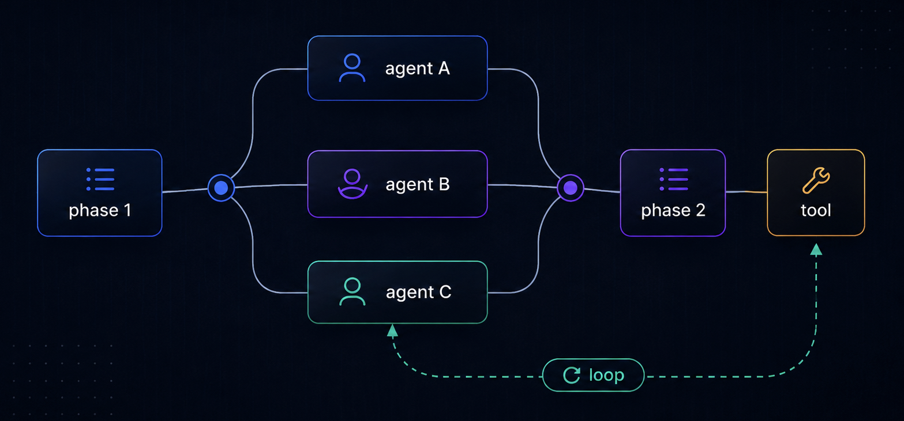

<p align="center">
  
</p>

<h1 align="center">Open Dynamic Workflow</h1>

<p align="center">
  <a href="https://www.npmjs.com/package/@travisliu/open-dynamic-workflow">
    
  </a>
  <a href="https://github.com/travisliu/open-dynamic-workflow/stargazers">
    
  </a>
</p>

<p align="center">&nbsp;</p>

Rename Notice: Renamed from `@prmflow/openflow` (binary: `openflow`) to `@travisliu/open-dynamic-workflow`

Open Dynamic Workflow is a local-first workflow runner for orchestrating external coding-agent CLIs such as Codex, Gemini, Copilot, OpenCode, Antigravity, Pi, Cursor, and a deterministic mock provider.

Natural-language prompts are flexible, but they are not always reliable for repeated engineering work. Open Dynamic Workflow turns repeatable agent tasks into workflow scripts, so execution is explicit, version-controlled, validated, and easier to reproduce.

A workflow script defines which agents run, how they are coordinated, what outputs are expected, and how failures are handled. This gives teams more stable execution than ad-hoc prompting, while making workflows easier to review, debug, reuse, and maintain.

## Start with an AI-generated workflow

To get started quickly, you can describe the workflow you want in natural language to an AI coding assistant to generate the workflow script. Once generated, use the CLI to validate and run it:

Prompt with skill:
`/open-dynamic-workflow Run a workflow that uses Codex to review correctness and security, uses Gemini to review tests and operations, then uses Gemini to summarize the result.`


## Supported coding agents

Open Dynamic Workflow orchestrates external coding-agent CLIs through provider adapters. It does not implement its own coding agent.

| Provider      | CLI                    |
| ------------- | ---------------------- |
| `mock`        | built-in mock provider |
| `codex`       | Codex CLI              |
| `gemini`      | Gemini CLI             |
| `copilot`     | GitHub Copilot CLI     |
| `opencode`    | OpenCode CLI           |
| `antigravity` | Antigravity CLI        |
| `pi`          | Pi Coding Agent        |
| `cursor`      | Cursor Agent CLI       |

The default provider can be configured during initialization or later in `.open-dynamic-workflow/config.yaml`. Individual workflow steps can still choose a specific provider:

```ts
const review = await agent({
  id: "security-review",
  provider: "codex",
  prompt: "Review this change for security risks."
});
```

## Install and initialize

Run Open Dynamic Workflow directly with `npx` (you can also use the shorthand `odw` alias if installed locally):

```bash
npx @travisliu/open-dynamic-workflow --help
```

Initialize Open Dynamic Workflow in your project:

```bash
npx @travisliu/open-dynamic-workflow init
```

This sets up the local Open Dynamic Workflow project structure, such as `.open-dynamic-workflow/config.yaml`, example workflow files, and default provider configuration.

Check your environment:

```bash
npx @travisliu/open-dynamic-workflow doctor
```

List discoverable workflows, shared agents, and tools:

```bash
npx @travisliu/open-dynamic-workflow list
```

Validate a workflow before running providers:

```bash
npx @travisliu/open-dynamic-workflow validate workflows/parallel-pr-review.ts
```

Run the workflow with local pretty output:

```bash
npx @travisliu/open-dynamic-workflow run parallel-pr-review --report pretty
```

## Basic Usage

The fastest way to create an Open Dynamic Workflow workflow is to ask the `open-dynamic-workflow` skill to generate one from a task description.

Use this prompt shape:

```text
/open-dynamic-workflow Create an Open Dynamic Workflow workflow that <does the task>. Use <providers>. Include commands to validate and run it.
```

The skill will choose the right workflow pattern, generate a valid workflow file, and include run instructions.

| Pattern          | Use when                                                                |
| ---------------- | ----------------------------------------------------------------------- |
| Single agent     | One agent can complete the task.                                        |
| Parallel review  | Multiple independent reviews can run at the same time.                  |
| Pipeline         | Many items need to pass through the same ordered stages.                |
| Fan-out / fan-in | Multiple branches run first, then a final agent summarizes the results. |
| Loop             | Repeated, stateful execution runs until a terminal condition is met.    |

### Demo 1: Single Agent Workflow

Use this when one agent can complete the task.

```text
/open-dynamic-workflow Create a workflow named single-review that uses Codex to review the current project for correctness, security, and maintainability issues. Include structured output for findings and commands to validate and run it.
```

Expected result:

* A workflow that calls `agent()` once.
* A clear `review` phase.
* A structured findings schema.
* Commands such as `openflow validate workflows/single-review.ts` and `openflow run workflows/single-review.ts`.

### Demo 2: Parallel Review Workflow

Use this when several independent perspectives should run at the same time.

```text
/open-dynamic-workflow Create a workflow that runs three independent reviews in parallel: Codex reviews correctness, Codex reviews security, and Gemini reviews tests. Then return all review results. Include commands to validate, run locally, and run with the mock provider for CI.
```

Expected result:

* A workflow that uses `parallel()`.
* Independent review branches.
* Stable agent IDs such as `correctness-review`, `security-review`, and `test-review`.
* CLI examples for local and CI usage.

### Demo 3: Pipeline Workflow

Use this when multiple items need the same ordered stages.

```text
/open-dynamic-workflow Create a pipeline workflow that reviews these files: src/auth.ts, src/billing.ts, and src/api.ts. Each file should go through analyze, plan, and review-plan stages. Use Codex for code analysis and plan review, Gemini for remediation planning, item-streaming strategy, concurrency 3, and failFast false. Include validation and run commands.
```

Expected result:

* A workflow that uses `pipeline()`.
* Named stages such as `analyze`, `plan`, and `review-plan`.
* `ctx.agent()` inside pipeline stages.
* Pipeline options such as `strategy`, `concurrency`, and `failFast`.

### Demo 4: Fan-Out / Fan-In Workflow

Use this when multiple branches should run first, then a final agent should summarize the results.

```text
/open-dynamic-workflow Create a workflow that uses Codex to review correctness and security, uses Gemini to review tests and operations, then uses Gemini to summarize the results, deduplicate findings, and recommend next steps. Include commands to validate and run it.
```

Expected result:

* A workflow that uses `parallel()` for the fan-out step.
* A final `agent()` call for the fan-in summary.
* Separate `review` and `summarize` phases.
* A final exported result containing both raw reviews and summary.

## Advanced Usage

For more complex orchestration patterns, Open Dynamic Workflow supports tool execution, child workflows, and goal-oriented loops.

### Demo 5: Tool-Assisted Workflow

Use this when the workflow should load or compute local data through a registered tool before asking an agent to analyze it.

```text
/open-dynamic-workflow Create a workflow that uses a registered read-json tool to load input.json, then uses Codex to analyze the loaded data for anomalies and correctness issues. Keep tool usage at the workflow top level. Include validation and run commands.
```

Expected result:

* A workflow that calls `tool()` before agent analysis.
* A provider-backed `agent()` call that receives the loaded tool output.
* No `tool()` calls inside `parallel()` or `pipeline()` stages.

### Demo 6: Child Workflow Composition

Use this when a larger workflow should reuse smaller workflow files.

```text
/open-dynamic-workflow Create a parent workflow that invokes a child workflow named security-review for src/auth.ts and src/billing.ts, collects child results with failureMode settled, then uses Gemini to summarize the results. Include the child workflow, the parent workflow, and commands to validate and run both.
```

Expected result:

* A reusable child workflow.
* A parent workflow that calls `workflow()`.
* JSON-safe `args` passed to the child workflow.
* A final summary step in the parent workflow.

### Demo 7: Goal-Oriented Loop Workflow

Use this when a repeated, stateful callback should run until a specific goal or condition is satisfied (e.g., review-fix-verify loops).

```text
/open-dynamic-workflow Create a workflow that runs a goal-oriented loop to review and fix code in src/auth.ts. In each round, use Codex to review remaining issues, Gemini to generate a fix plan, and Codex to verify the plan. Loop up to 5 times or stop when the plan is accepted. Include commands to validate and run it.
```

Expected result:

* A workflow that uses `loop()`.
* A round callback returning `{ done: true, nextState }` when the verification succeeds.
* Loop options including `maxRounds` (required, e.g., 5).
* The loop result containing the final state directly, or a settled success/failure envelope.
* Commands such as `npx @travisliu/open-dynamic-workflow validate workflows/loop-review.ts` and `npx @travisliu/open-dynamic-workflow run workflows/loop-review.ts`.

### Prompting Tips

* Name the workflow you want.
* Describe the input files, documents, or targets.
* Say which providers to use, such as Codex for correctness/security and Gemini for tests/summarization.
* Say whether failures should stop the workflow or be collected.
* Ask for validation and run commands.
* Ask for structured output when downstream steps need machine-readable results.

## open-dynamic-workflow Skills

For AI/coding agents developing workflows in this repository, a pre-configured skill is located at [skills/open-dynamic-workflow/](skills/open-dynamic-workflow/).

This directory contains:
- [SKILL.md](skills/open-dynamic-workflow/SKILL.md): Instructions and guidelines for AI agents to write, validate, and troubleshoot Open Dynamic Workflow workflows.
- Reference documentation under [references/](skills/open-dynamic-workflow/references/):
  - [api-document.md](skills/open-dynamic-workflow/references/api-document.md): Complete guide on workflow syntax, DSL primitives (`agent`, `parallel`, `pipeline`), structured outputs, and exit codes.
  - [cli-commands.md](skills/open-dynamic-workflow/references/cli-commands.md): Detailed usage details for the `run`, `validate`, and `doctor` commands.
  - [configuration.md](skills/open-dynamic-workflow/references/configuration.md): Schema structure, precedence rules, and model customization guidelines for `.openflow/config.yaml`.
- Reusable templates under `assets/` for building new workflows.

## Artifacts

Every run creates a local artifact directory.

```text
.openflow/runs/<runId>/
  manifest.json
  workflow.input.ts
  config.resolved.json
  run-input.json
  calls.jsonl
  cache-index.json
  events.jsonl
  report.json
  agents/
    <agentId>/
      prompt.txt
      stdout.log
      stderr.log
      raw-result.json
      normalized-result.json
      schema.json
      validation-error.json
      permissions.json
      metadata.json
  workflows/
    <workflowInvocationId>/
      input.json
      result.json
      error.json
      summary.json
```

Artifacts are always enabled so failed or partial runs remain debuggable.


## Configuration

By default, Open Dynamic Workflow loads:

```text
.open-dynamic-workflow/config.yaml
```

Example:

```yaml
defaultProvider: codex
concurrency: 4
timeoutMs: 900000
maxAgentCalls: 20

providers:
  codex:
    command: codex
    args:
      - exec
      - --json
      - --ephemeral
    defaultModel: null

  gemini:
    command: gemini
    args:
      - --output-format
      - json
    defaultModel: gemini-3-flash-preview

security:
  passEnv: []
  redactEnv:
    - OPENAI_API_KEY
    - GEMINI_API_KEY
    - GOOGLE_API_KEY
    - '*_TOKEN'
    - '*_SECRET'
```

Configuration precedence:

1. CLI safety ceilings and hard overrides.
2. Explicit `agent()` options.
3. Workflow defaults, if introduced later.
4. Config file.
5. Built-in defaults.

`--provider` sets the default provider. It does not override an explicit provider inside an `agent()` call.

`maxAgentCalls` limits how many live provider agent calls a run may start. Resume cache hits do not count as new live calls. The CLI flag `--max-agent-calls` overrides the config value for that run.

#### Safety & System Context:

- **No Scoped Sandbox:** The `dangerously-full-access` mode is **not** a sandbox or a scoped-write system. It grants full permission mapping to the underlying provider CLI, bypassing safety boundaries in that provider context.
- **Provider Support Behavior:**
  - `codex`: Maps `dangerously-full-access` to the Codex write-capable flag (`--dangerously-bypass-approvals-and-sandbox`).
  - `gemini`: Supports `dangerously-full-access`. By default, Gemini runs in read-only `--approval-mode plan`. Specifying `dangerously-full-access` switches Gemini to `--approval-mode yolo`, enabling write-capable execution. This is the explicit opt-in; Gemini's own trust and sandbox rules still apply.
  - `copilot`: Default mode does not add broad allow-all or yolo flags. `dangerously-full-access` maps to `--yolo`.
  - `opencode`: Maps `dangerously-full-access` to `--dangerously-skip-permissions` and skips read-only environment injection.
  - `antigravity`: Maps `dangerously-full-access` to `--dangerously-skip-permissions`.
  - `pi`: Switches from read-only tools to configured `fullAccessTools`. It does not imply automatic approval.
  - `cursor`: Runs with `--mode ask` by default. Specifying `dangerously-full-access` maps to the configured dangerous flag, default `--force`.
  - `mock`: Accepts `dangerously-full-access` without changing its deterministic mock behavior (useful for dry runs and testing).
  - Workflows that omit the `permissions` field default to `{ mode: "default" }` (which does not pass any write-enabling flags to the provider).

Be careful before sharing `.openflow/runs/<runId>` artifacts, because they may contain prompts, source snippets, stdout, stderr, and model outputs.

## License

MIT
